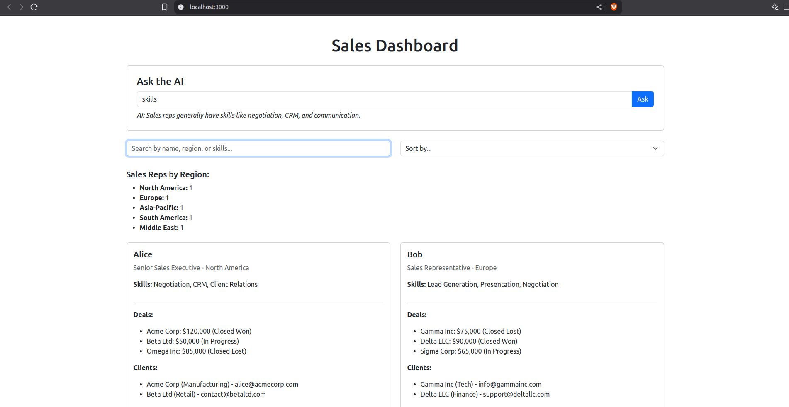
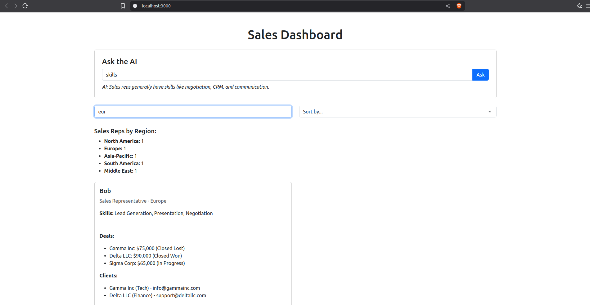

# 📊 Sales Dashboard App

A responsive full-stack web application for viewing and interacting with sales representative data, built with Next.js (frontend) and FastAPI (backend).

 <!-- Replace with actual screenshot -->


## 🚀 Features

- View detailed sales rep profiles: role, region, skills, deals, and clients
- Ask questions via a mock AI assistant
- Search & filter reps by name, region, or skill
- Sort reps by number of deals or region
- View summary statistics by region
- Responsive design for all device sizes

## 🛠️ Tech Stack

**Frontend:**
- Next.js 13
- React 18
- Bootstrap 5

**Backend:**
- FastAPI
- Python 3.10+

**Development:**
- TypeScript (frontend)
- Vercel (deployment ready)
- Uvicorn (ASGI server)

## 📦 Setup Instructions

### 1. Clone the Repository
```bash
git clone https://github.com/DeemasDee/coding-test.git
cd coding-test
```

### 2. Backend Setup (FastAPI)
```bash
cd backend
python -m venv venv
# On Linux/Mac:
source venv/bin/activate
# On Windows:
.\venv\Scripts\activate

pip install -r requirements.txt
```

Start the API server:
```bash
uvicorn main:app --reload
```
The backend will run at: http://localhost:8000


### 3. Frontend Setup (Next.js)
```bash
cd ../frontend
npm install
```

Start the development server:
```bash
npm run dev
```
The app will be available at: http://localhost:3000


## 🧠 Design Choices
- FastAPI: Chosen for its simplicity and speed in serving structured JSON data
- Next.js: Enables fast development with responsive components and SSR-ready framework
- Bootstrap 5: Provides responsive layouts with minimal custom CSS
- Component Architecture: Modular design for maintainability
- Mock AI Endpoint: Simulates interactivity without external dependencies


## 🔮 Potential Improvements
- Integrate real AI assistant (OpenAI/Gemini API)
- Add authentication & user roles
- Export data to CSV/PDF functionality
- Implement data visualization with Chart.js
- Add dark mode toggle
- Enhanced mobile responsiveness
- Unit/Integration testing


---

## Getting Started

1. **Clone or Download** this repository (or fork it, as described above).
2. **Backend Setup**  
   - Navigate to the `backend` directory.  
   - Create a virtual environment (optional but recommended).  
   - Install dependencies:  
     ```bash
     pip install -r requirements.txt
     ```  
   - Run the server:  
     ```bash
     uvicorn main:app --host 0.0.0.0 --port 8000 --reload
     ```  
   - Confirm the API works by visiting `http://localhost:8000/docs`.

3. **Frontend Setup**  
   - Navigate to the `frontend` directory.  
   - Install dependencies:  
     ```bash
     npm install
     ```  
   - Start the development server:  
     ```bash
     npm run dev
     ```  
   - Open `http://localhost:3000` to view your Next.js app.

4. **Data**  
   - The file `dummyData.json` is located in the `backend` directory (or wherever you place it).
   - Adjust your API endpoint and frontend calls if you use different paths or filenames.

5. **AI Feature (If Implemented)**  
   - Add a POST endpoint to handle AI requests, for example `/api/ai`.  
   - In the frontend, create a simple form to collect user questions and display the returned answer.
   - Feel free to use any **free or trial LLM API** mentioned above or implement a rule-based approach.

6. **Tips for Completion**
   - **Start Small**: Fetch the data, display it, then expand to more complex UI or AI functionality.
   - **Testing**: You may add unit or integration tests if time permits.
   - **UI Libraries**: Feel free to use any UI library or styling approach (Tailwind, CSS modules, etc.) if desired.
   - **Extensions**: You can incorporate charts, filters, or sorting to demonstrate extra skills.

---

**Good luck, and have fun building your Sales Dashboard!**
